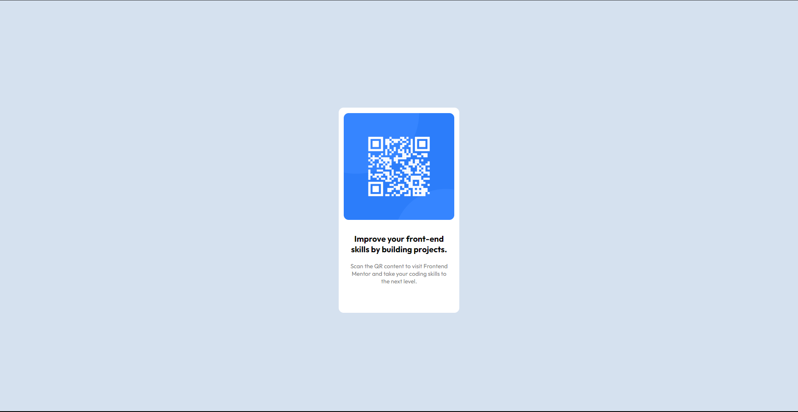

# Frontend Mentor - QR code component solution

This is a solution to the [QR code component challenge on Frontend Mentor](https://www.frontendmentor.io/challenges/qr-code-component-iux_sIO_H). Frontend Mentor challenges help you improve your coding skills by building realistic projects. 

### Screenshot

### Built with

- Semantic HTML5 markup
- CSS custom properties
- Flexbox

### What I learned

I realized that body and viewport are not the same. The body takes the space of the content present on the screen. Not knowing this, I struggled for a while as to thinking, why is my div not centering vertically.

## Author

- Frontend Mentor - [@SriMidhinesh](https://www.frontendmentor.io/profile/SriMidhinesh)